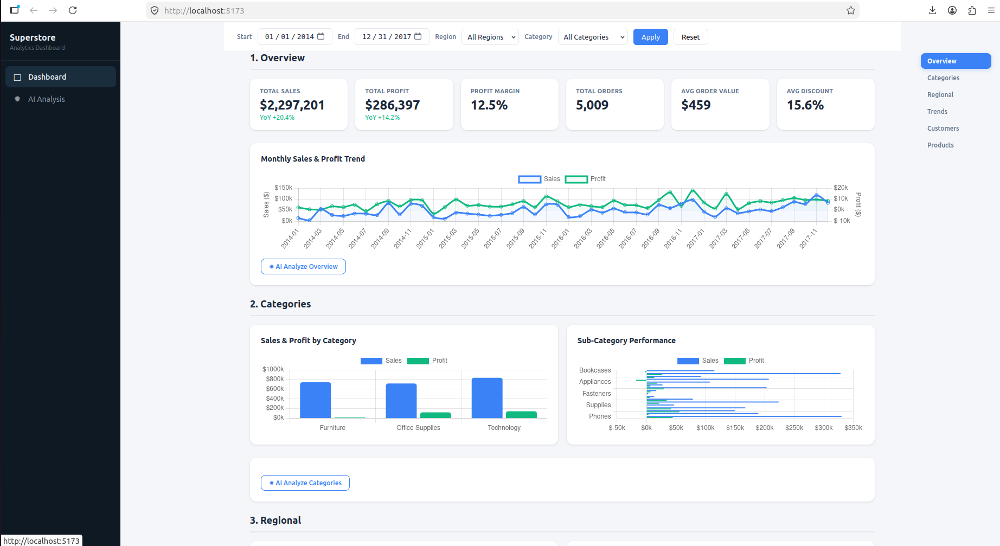

# Superstore Analytics Dashboard

An AI-powered business analytics dashboard built with Flask, Vue 3, and React 18,
using the classic [Sample Superstore](https://www.kaggle.com/datasets/vivek468/superstore-dataset-final) dataset.

## Features

- **Multi-dimensional analysis**: Overview, Categories, Regional, Trends, Customers, Products — 6 analysis modules
- **Interactive charts**: Bar, line, doughnut charts powered by Chart.js with real-time filtering
- **AI-powered insights**: DeepSeek LLM integration for automated business analysis on each module
- **Dual frontend**: Identical functionality implemented in both Vue 3 and React 18 for comparison
- **Apple-inspired design**: Clean, modern UI with glass-morphism effects and responsive layout

## Screenshot



## Architecture

```
┌─────────────────┐     ┌──────────────────────────────┐
│  Flask Backend   │────▶│  Vue 3 Frontend (port 5173)  │
│  (port 5000)     │     │  React 18 Frontend (port 5176)│
│                  │     │                              │
│  data_processor  │     │  Chart.js + marked +         │
│  pandas + numpy  │     │  DeepSeek AI integration     │
└─────────────────┘     └──────────────────────────────┘
```

- **Backend**: Flask reads the Superstore CSV, processes data with pandas, and serves 7 REST APIs
- **Frontend**: Two SPA implementations (Vue 3 / React 18) consume the same APIs, render charts and tables
- **AI**: DeepSeek API (proxied through backend) provides on-demand business analysis

## Data

The [Sample Superstore](https://www.kaggle.com/datasets/vivek468/superstore-dataset-final) dataset contains 9,994 retail orders (2014-2017) across the United States.

| Dimension | Values |
|-----------|--------|
| Categories | Furniture, Office Supplies, Technology |
| Regions | East, West, Central, South |
| Segments | Consumer, Corporate, Home Office |
| Metrics | Sales, Profit, Quantity, Discount |

## API Endpoints

| Endpoint | Description |
|----------|-------------|
| `GET /api/filters` | Available filter options (regions, categories, date range) |
| `GET /api/overview` | KPI summary (total sales, profit, orders, YoY growth, monthly trend) |
| `GET /api/categories` | Category and sub-category performance breakdown |
| `GET /api/regional` | Regional and state-level analysis |
| `GET /api/timeseries` | Monthly and yearly sales/profit trends |
| `GET /api/segments` | Customer segment analysis with cross-tabulation |
| `GET /api/products` | Top/Bottom product rankings |

All endpoints support optional query parameters: `start_date`, `end_date`, `region`, `category`.

## Quick Start

### 1. Install Python dependencies

```bash
pip install -r requirements.txt
```

### 2. Start the backend

```bash
python app.py
# Server runs at http://localhost:5000
```

### 3. Start a frontend

**Vue version:**
```bash
cd frontend_vue
npm install
npm run dev
# Opens at http://localhost:5173
```

**React version:**
```bash
cd frontend_react
npm install
npm run dev
# Opens at http://localhost:5176
```

### 4. Configure AI (optional)

```bash
export DEEPSEEK_API_KEY="your-api-key"
```

Without this, charts and tables work normally; only the "AI Analyze" buttons will show an error.

## Project Structure

```
/
├── app.py                    # Flask API server
├── data_processor.py         # Data loading, filtering, aggregation (pandas)
├── requirements.txt          # Python dependencies
├── data/
│   └── Superstore.csv        # 9,994-row retail dataset
├── frontend_vue/             # Vue 3 + Vite implementation
│   ├── package.json
│   ├── vite.config.js
│   └── src/
│       ├── main.js           # Entry point
│       ├── App.vue           # Root component (sidebar + router)
│       ├── router/index.js   # Route definitions
│       ├── config.js         # API URL helpers
│       ├── lib/              # API client, AI client, formatting utilities
│       ├── components/       # SidebarNav, FilterBar, KpiCards
│       ├── views/            # DashboardView, AiAnalysisView
│       └── assets/app.css    # Apple-inspired design system
└── frontend_react/           # React 18 + Vite implementation
    └── src/                  # (mirrors Vue structure)
        ├── main.jsx
        ├── App.jsx
        ├── components/       # SidebarNav, FilterBar, KpiCards
        ├── views/            # DashboardView, AiAnalysisView
        └── lib/              # (shared with Vue version)
```

## Tech Stack

| Layer | Technology |
|-------|-----------|
| Backend | Python 3, Flask, pandas, NumPy |
| Frontend A | Vue 3 (Composition API), Vite, Chart.js, marked |
| Frontend B | React 18 (Hooks), Vite, Chart.js, marked |
| AI | DeepSeek Chat API |
| Data | Sample Superstore (Kaggle) |
